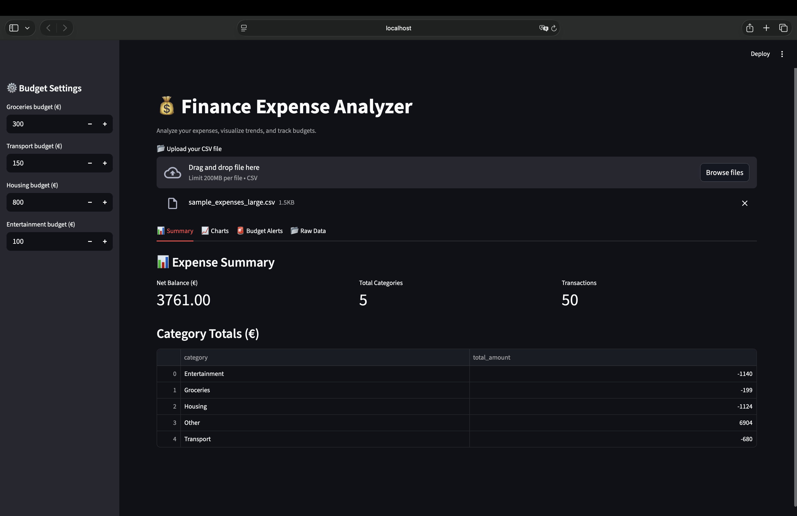
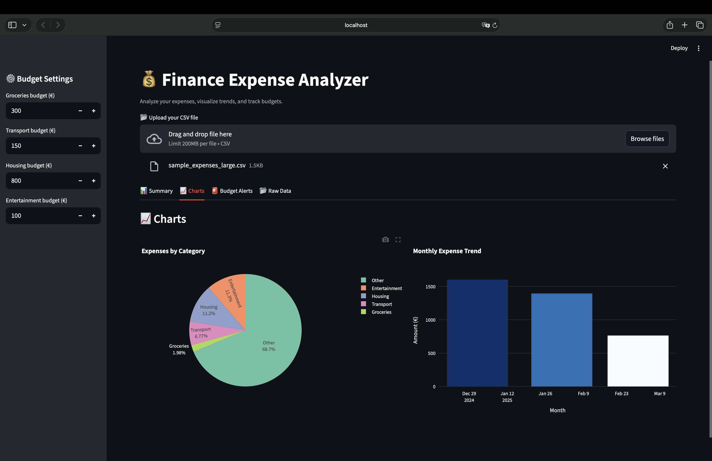

# 💰 Finance Expense Analyzer

[](https://www.python.org/)
[](https://streamlit.io/)
[](tests)
[](https://github.com/Keobu/finance-analyzer/actions/workflows/tests.yml)
[](LICENSE)

> Track your spending, surface insights, and keep budgets honest with a Streamlit dashboard that feels like an internal finance tool.

## 👋 About the Project
Finance Expense Analyzer is a Python-first toolkit for cleaning messy bank exports and turning them into actionable insights. Drop in a CSV, let the preprocessing and categorisation pipeline do the heavy lifting, then explore the results through an interactive Streamlit dashboard powered by Plotly visuals.

## ✨ Features
- 📥 **CSV ingestion** – upload or point to raw transaction exports and let the app normalise column names automatically.
- 🧹 **Preprocessing & validation** – robust error handling for missing files, malformed dates, and quirky encodings.
- 🏷️ **Smart categorisation** – rule-driven tagging for Groceries, Transport, Housing, Entertainment, and more.
- 📈 **Expense analytics** – monthly totals, category breakdowns, and an always-on net balance tracker.
- 📊 **Interactive Plotly charts** – drill into categories or months with responsive pie and bar charts.
- 🚨 **Budget alerts** – flag overspending before it derails your plan.
- 🧭 **Streamlit dashboard tabs** – Summary, Charts, Budget Alerts, and Raw Data keep the journey organised.
- 📤 **Export options** – download curated CSV reports straight from the UI.
- ✅ **Unit-tested pipeline** – pytest covers preprocessing, categorisation, budgets, visuals, and analytics.

## 🗂️ Project Structure
```text
finance-analyzer/
├─ app.py                  # Streamlit entry point
├─ requirements.txt        # Project dependencies
├─ data/
│  ├─ raw/                 # Input CSVs (includes sample_expenses_large.csv)
│  └─ processed/           # Cleaned datasets, if you persist them
├─ docs/
│  └─ images/              # README screenshots and gallery assets
├─ results/                # Exported charts (created on demand)
├─ scripts/
│  ├─ run_dashboard.py     # Launch Streamlit without the onboarding prompt
│  └─ generate_gallery_assets.py  # Rebuild screenshots from sample data
├─ src/
│  ├─ analysis.py          # Metrics: monthly totals, category totals, net balance
│  ├─ budget.py            # Budget threshold checks & alerts
│  ├─ categorize.py        # Keyword-driven expense categorisation
│  ├─ preprocessing.py     # CSV loader, cleaning, validation helpers
│  ├─ visualization.py     # Plotly chart builders for dashboard + exports
│  └─ ...                  # Config, IO utilities, exceptions, initialisers
└─ tests/                  # pytest suite covering the core workflow
```

## 🚀 Installation & Usage
1. **Clone the repository**
   ```bash
   git clone https://github.com/Keobu/finance-analyzer.git
   cd finance-analyzer
   ```
2. **Install dependencies** (ideally inside a virtual environment)
   ```bash
   python3 -m venv .venv
   source .venv/bin/activate  # Windows: .venv\Scripts\activate
   pip install -r requirements.txt
   ```
3. **Run the dashboard**
   ```bash
   python3 scripts/run_dashboard.py
   ```
   or, if you prefer the classic entry point:
   ```bash
   streamlit run app.py
   ```
4. Upload your CSV (or start with the bundled `data/raw/sample_expenses_large.csv`) and explore the tabs for summaries, visuals, alerts, and raw data.

## 📸 Screenshots
| Preview | Description |
| --- | --- |
|  | Streamlit dashboard summary tab with KPIs & recent metrics |
|  | Live Plotly visuals for category share and monthly spend |

> Need updated screenshots? Regenerate them with `python3 scripts/generate_gallery_assets.py` after adjusting the sample data.

## 🧪 Testing
Run the full test suite (verbose output) with:
```bash
pytest -v
```
Add `-ra` to surface the reason for any skipped tests:
```bash
pytest -v -ra
```

| Result | Details |
| --- | --- |
| ✅ Passed | 22 tests covering preprocessing, categorisation, budgets, analysis, and visuals |
| ⚠️ Skipped | 2 Plotly export tests that require Kaleido for static image generation |

To enable the skipped image-export tests, install Kaleido and rerun:
```bash
pip install -U kaleido
pytest -v
```

Want coverage numbers? Install `pytest-cov` and run:
```bash
pytest --cov=src --cov-report=term-missing
```
Feel free to extend the suite as you evolve preprocessing rules or dashboard behaviour.

## 🗃️ Sample CSV
A ready-to-use dataset lives at `data/raw/sample_expenses_large.csv`. It contains 60 rows of synthetic transactions so you can explore the pipeline without touching production data.

## 🛣️ Roadmap
1. Polished documentation with walkthrough videos and tips
2. Deeper test coverage (property-based checks, budget edge cases)
3. Deployment recipes (Streamlit Community Cloud, Docker image)
4. Optional ML-assisted categorisation and anomaly detection

## 🧷 Badge Ideas
When you wire up CI/CD or deployment, consider adding badges for live deployments, coverage, or container images alongside the ones above.

## 📄 License
Released under the [MIT License](LICENSE). Use it, extend it, and let me know if you build something cool on top. 🚀
