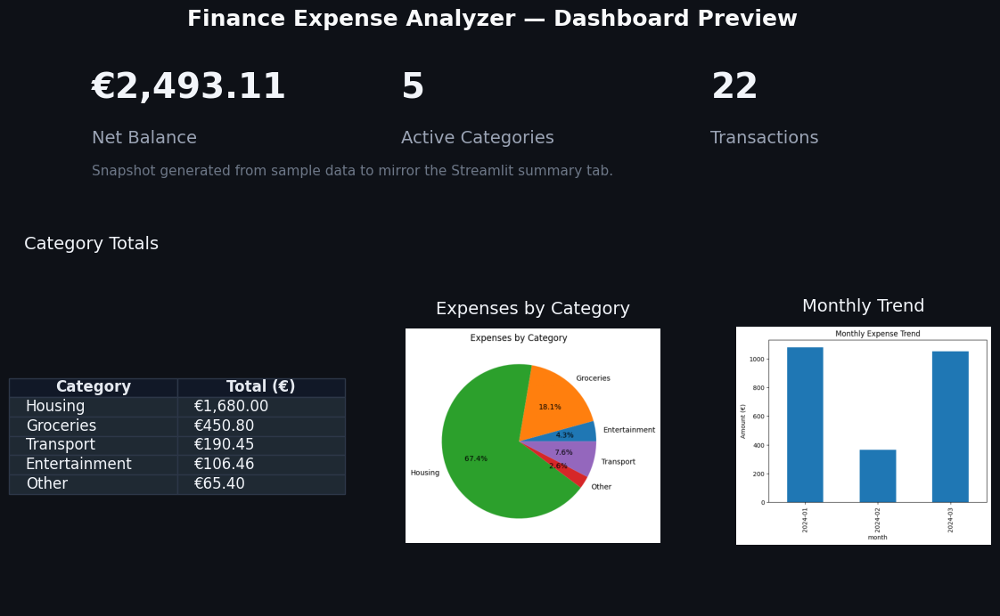
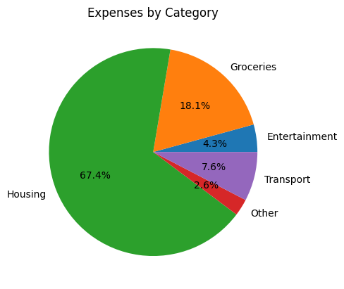
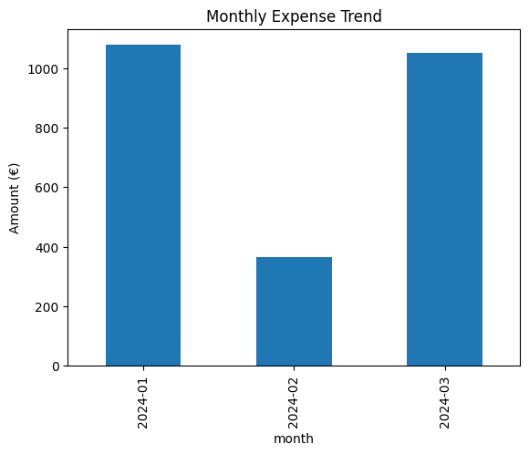

# 💰 Finance Expense Analyzer

[](https://www.python.org/)
[](https://streamlit.io/)
[](LICENSE)
[](tests)
[](https://github.com/Keobu/finance-analyzer/actions/workflows/tests.yml)

> Track spending, surface insights, and stay ahead of budget surprises — all in one streamlined dashboard.

## 👋 Why I Built This
I wanted a finance companion that handles the real-world messiness of bank exports while still feeling polished enough to share with teammates or clients. Finance Expense Analyzer ingests CSV statements, tidies the data, and serves up an interactive Streamlit experience so you can see where every dollar goes and spot budget risks before they escalate.

## ✨ Features
- 📥 **CSV import & cleanup** — normalize quirky bank exports and prepare them for analysis automatically.
- 🧠 **Smart categorization rules** — consistent tagging for recurring merchants and spending groups.
- 📊 **Rich analytics views** — monthly trends, category heatmaps, and cumulative spend snapshots.
- 📈 **Interactive Plotly charts** — hover for tooltips, drill into time ranges, and export visuals.
- 🚨 **Budget alerts** — highlight overspending so you can react instead of react later.
- 💻 **Streamlit dashboard** — dark theme tabs for Summary, Charts, Budget Alerts, and Raw Data.
- 📤 **One-click CSV export** — download filtered transactions or curated reports for stakeholders.

## 🗂️ Project Structure
```text
finance-analyzer/
├─ app.py                  # Streamlit entry point
├─ requirements.txt        # Python dependencies
├─ data/
│  ├─ raw/                 # Unmodified sample/imported CSV statements
│  └─ processed/           # Cleaned datasets ready for analysis
├─ results/                # Generated reports, charts, and exports
├─ src/
│  ├─ __init__.py
│  ├─ analysis.py          # Spend summaries and metrics calculations
│  ├─ budget.py            # Budget thresholds and alert logic
│  ├─ categorize.py        # Rule-based transaction categorization
│  ├─ config.py            # Central configuration helpers
│  ├─ exceptions.py        # Custom error types for predictable handling
│  ├─ init.py              # Data seeding and bootstrap utilities
│  ├─ preprocessing.py     # Data cleaning, normalization, feature engineering
│  ├─ utils_io.py          # File loading, validation, and exports
│  └─ visualization.py     # Plotly chart builders used across the app
└─ tests/
   ├─ test_analysis.py
   ├─ test_categorize.py
   └─ test_preprocessing.py
```

## 🚀 Getting Started
1. Clone the repository:
   ```bash
   git clone https://github.com/Keobu/finance-analyzer.git
   cd finance-analyzer
   ```
2. Create and activate a virtual environment:
   ```bash
   python3 -m venv .venv
   source .venv/bin/activate  # Windows: .venv\Scripts\activate
   ```
3. Install dependencies:
   ```bash
   pip install -r requirements.txt
   ```

## 🧭 Usage
Run the Streamlit dashboard and follow the on-screen prompts to upload your CSV file.
```bash
streamlit run app.py
```
The app opens in your browser with four tabs:
- **Summary** — high-level KPIs and aggregated stats.
- **Charts** — Plotly visuals (pie, bar, line) with interactive filtering.
- **Budget Alerts** — overspending callouts and threshold controls.
- **Raw Data** — searchable, exportable transaction table.

## 📸 Screenshots
Captured from the sample dataset bundled with the repository.

| Section | Preview |
| --- | --- |
| Dashboard Overview |  |
| Category Breakdown (Pie) |  |
| Monthly Spend Trend (Bar) |  |

> Regenerate the gallery after updating the data by running `python3 scripts/generate_gallery_assets.py`.

## ✅ Testing
Run the unit test suite with pytest once your virtual environment is active:
```bash
python -m pytest
```
Add more tests as you extend categorization rules, preprocessing logic, or dashboard callbacks to keep regressions in check.

## 🛣️ Roadmap
1. **Foundation** — project scaffolding, virtual environment, and data folders.
2. **Core Engine** — ingestion, preprocessing, and categorization modules.
3. **Dashboard** — Streamlit UI with multi-tab navigation and Plotly charts.
4. **UX Polish** — dark theme, interactive controls, CSV export, documentation.
5. **Testing** — pytest coverage for data pipelines and business logic.
6. **Deployment** — Streamlit Community Cloud or container-based hosting.

## 🔖 Topics
`python` · `finance` · `expenses` · `data-analysis` · `streamlit` · `plotly`

## 📄 License
Released under the [MIT License](LICENSE). Feel free to fork it, customize the pipeline, and share what you build.

## 🧷 Badge Ideas
Consider swapping in the following shields for a more production-ready look:
- Python version (`https://img.shields.io/badge/python-3.11+-3776AB?logo=python`)
- Streamlit status (`https://img.shields.io/badge/Streamlit-live-FF4B4B?logo=streamlit`)
- License (`https://img.shields.io/badge/License-MIT-green`)
- Test workflow badge from your CI provider (e.g., GitHub Actions status badge)

---
If you spin this up for your own budgets, I'd love to hear how you extend the rules or rethink the visuals. Happy analyzing! 🧮
